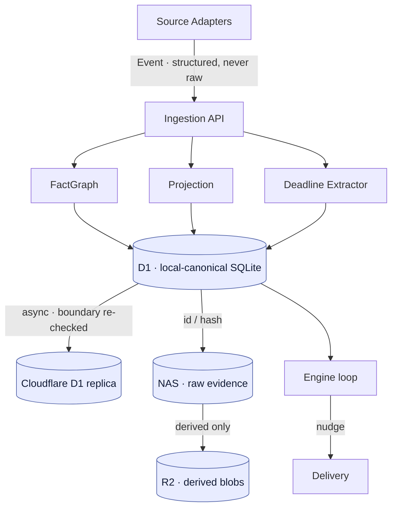

# Cadence

**Cadence is a self-hosted, single-user personal attention & context guardian.** It
ingests events from your accounts and devices, turns them into provenance-tagged facts
and deadlines, infers what actually matters right now, and — when it's confident — nudges
you when your attention has drifted from it (the canonical case: you're immersed in the
7-day task while the 1-day report is quietly coming due).

It is built to run on hardware you own, with a hard architectural boundary between *raw
evidence* and *structured signal*, credentials that never leave a local vault, and every
inference/nudge path **off by default** until you explicitly turn it on. Nothing records,
sends, or infers silently.

> Status: this is a personal project, published source-available. It is functional
> end-to-end in shadow mode (the brain runs, reasons, and proposes nudges) but a fully
> "live" deployment requires you to plug in your own credentials, device tokens, and an
> LLM provider — every such seam is documented and gated, never implicitly enabled.

---

## What's built

Six milestones, all with tests (Python: **404 passing**, ruff clean; Rust core: `cargo
test`/`clippy`/`fmt` clean). CI runs all of it on every push — see below.

| # | Area | What it is |
|---|------|-----------|
| **M1** | **Foundation spine** | Source-Adapter framework, provenance `Event` schema, NAS-only credential vault, local-canonical D1 (SQLite) store, the structural raw-boundary, NAS/R2 blob tiers, the provenance fact graph, typed-row projection, the ingest pipeline (WAL + backpressure + dedupe), the FastAPI brain (fail-closed mTLS gate), a rule-based deadline parser, and an observability skeleton. |
| **M2** | **Device agents** | A portable, crash-safe Rust capture core (`agents/core`: WAL, dedupe, backpressure, mTLS transport) exposed over a C ABI, with an Android (JNI) agent and a Windows (P/Invoke, net8.0) agent binding to it, plus the device↔brain wire contract. |
| **M3** | **Attention & priority engine** | The reasoning loop: an `AttentionState` detector (idle/immersed/scattered), a priority + **misallocation** detector, and a **Nudge Governor** (precision-first, shadow/live modes, idempotency, Thanks/Dismiss feedback that adjusts thresholds). |
| **M4** | **LLM inference path** | A gated provider abstraction (API-key and ChatGPT-OAuth), an unbypassable raw-content egress audit, an LLM-backed deadline/receptiveness inference wired into the pipeline seams, and an onboarding OAuth (PKCE) login flow — **off unless explicitly enabled + configured + credentialed**. |
| **M5** | **Runtime** | The pieces that make it *run*: a resilient tick scheduler, nudge delivery (console / FCM HTTP v1 / mock), the LLM factory that only activates when gated conditions are met, a feedback endpoint, and one service entrypoint that composes the whole brain. |
| **M6** | **Devbox source** | A capture source for an always-on dev server (the machine that runs your coding jobs while you're mobile): git WIP / stale-branch signals, "your run finished/crashed while you were away", activity cadence, and host health — **content-free and own-user-only by construction** (see Privacy). |

The architecture rationale and the system invariants are documented in `AGENTS.md`.

## Privacy & honesty posture (enforced in code, not just promised)

- **Raw boundary is structural.** Every D1 write passes a per-table/column allowlist
  (`SchemaBoundary`, built from the ORM metadata) plus a heuristic classifier backstop.
  Raw evidence lives *only* in NAS, referenced by opaque id/hash; D1 and the Cloudflare
  replica and R2 hold structured/derived data only. Verbatim content never reaches the
  cloud.
- **Credentials never leave a local, boundary-checked vault** (`nas_root`, chmod 0700/0600,
  refuses the checked-in default master key in prod).
- **Every raw-content egress is logged** through one of exactly two sanctioned channels
  (`llm_text`, `daglo_audio`) via an audit that the LLM base client cannot bypass.
- **Nothing goes live automatically.** The Nudge Governor defaults to *shadow* mode
  (proposes, never delivers). The LLM factory returns a provider only when `llm_enabled`
  **and** a provider is configured **and** the vault holds a matching credential —
  otherwise `None`, with a logged reason.
- **The ChatGPT-OAuth LLM path is opt-in and explicitly gray-zone** (it presents the
  public Codex client to the ChatGPT backend; unsupported for non-Codex use, may break,
  ToS gray). Onboarding prints the warning and requires confirmation. The API-key provider
  is the supported, recommended default.
- **Device/audio capture is gated.** No 24/7 recording; co-presence/audio (a presence-gated
  office node) is a separately-gated design step, not enabled here.
- **The devbox source is content-free and own-user-only.** It emits repo names/branches,
  command *verbs* (never arguments), counts, timestamps and health — never source, diffs,
  file names, env, secrets, or full command lines. It captures only the current user's
  resources (uid/`$HOME` filtered, fails **closed** on an undeterminable owner; container
  health is trusted only under rootless per-user Docker). Read-only.

## Quickstart (the brain)

This is a [`uv`](https://docs.astral.sh/uv/)-native project (`uv.lock` committed):

```bash
uv sync            # create .venv from the lockfile (dev tools included)

# Test + lint
uv run pytest
uv run ruff check .

# Run the full runtime — ingest API + engine + delivery (schema self-initializes).
# Serves on 127.0.0.1:3245 by default (0x0CAD; override with CADENCE_HTTP_PORT).
CADENCE_REQUIRE_MTLS=false uv run cadence runtime

# Feed it this machine's live signals (in another shell)
CADENCE_INGEST_URL=http://127.0.0.1:3245/ingest/event uv run cadence devbox --once
```

A single `cadence` command drives everything: `cadence runtime`, `cadence devbox`,
`cadence onboarding`. To run the brain + devbox poller as **systemd** user services
(via `uv`), see [`packaging/`](packaging/).

Configuration is environment-based (prefix `CADENCE_`, optional `.env`) — see
`cadence/config.py` and `RuntimeConfig` in `cadence/runtime/service.py` for every setting
(HTTP host/port, storage-tier paths, the `nas_root` trust boundary, `env` for prod
fail-closed gates, governor mode, delivery provider, LLM on/off + provider, mTLS). All
paths default to relative `var/` locations and are overridable; no absolute or personal
paths are baked in.

The device agents live under `agents/` (`core` = Rust, `android` = JNI, `windows` =
net8.0); each has its own README. The Rust core builds with `cargo build`; the Android and
Windows agents build on their respective platforms (the Windows agent requires a Windows
toolchain — CI builds it on a Windows runner).

## Continuous integration

`.github/workflows/ci.yml` runs four jobs on every push/PR, with **every third-party
action pinned to a full commit SHA** for supply-chain safety:

- **Python** (Ubuntu) — `ruff check` + `pytest`
- **Rust core** (Ubuntu) — `cargo fmt --check`, `clippy -D warnings`, `cargo test`
- **Android** (Ubuntu) — installs the NDK, cross-compiles the core to per-ABI `jniLibs`,
  runs `./gradlew assembleDebug`, uploads the APK
- **Windows agent** (Windows) — builds and publishes the net8.0 agent (the only place
  WPF/UI-Automation builds) and uploads it as an artifact

## Architecture (the built spine)



**Source Adapters** (GitHub · Google Calendar · Email · devbox · device agents) `fetch → normalize → emit` provenance-tagged Events — structured fields plus a NAS pointer, never raw. **Ingestion** (FastAPI, mTLS, fail-closed) WAL-buffers and dedupes, then fans out to the **FactGraph**, the typed-row **Projection** (`calendar_event`/`task`), and the **Deadline Extractor** (rule-based, optional LLM hook). All land in **D1**, the local-canonical SQLite store — every write passes the structural `SchemaBoundary` + `PayloadClassifier`, so no verbatim content is stored. D1 replicates structured rows off-site to **Cloudflare D1**; raw evidence lives only in **NAS** (content-addressed), and derived blobs go to **R2**. The **Engine loop** (AttentionState → priority + misallocation → Nudge Governor, shadow/live) drives **Delivery**.

**Invariants** (full list in `AGENTS.md`): hot-path reads/writes hit local SQLite, never
the cloud replica; D1/R2/replica hold structured/derived only — raw lives solely in NAS by
opaque reference, enforced by the structural allowlist; credentials live only in the
NAS-only vault, boundary-checked against `nas_root`; every raw-content egress goes through
one of two logged channels; the mTLS ingest gate fails closed; the engine defaults to
shadow mode.

## Repository layout

```
cadence/        the brain — adapters, stores, ingest, brain, engine, llm, runtime, onboarding, obs
agents/         device agents — core (Rust), android (JNI), windows (net8.0)
contract/       the device↔brain wire contract (event envelope schema + protocol)
alembic/        the frozen D1 schema migration
tests/          the Python test suite (404 tests)
.github/        CI (SHA-pinned)
AGENTS.md       architecture rationale + the system invariants
```

## License

Licensed under the **GNU Affero General Public License v3.0 or later** (AGPL-3.0-or-later)
— see [`LICENSE`](LICENSE). The AGPL's network-use clause matters for a self-hosted service
like this: if you run a modified version and let others interact with it over a network,
you must offer them the corresponding source.
